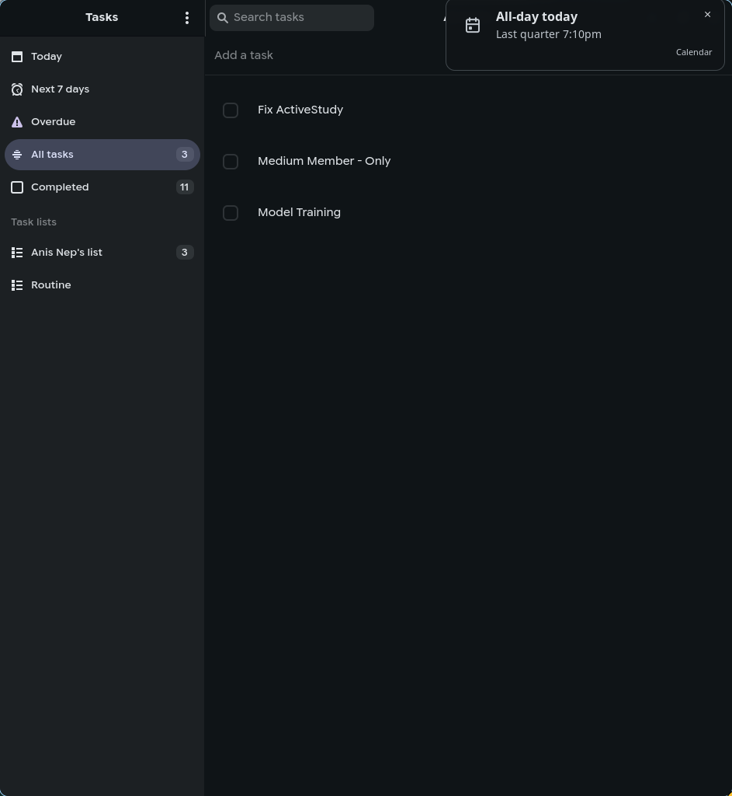
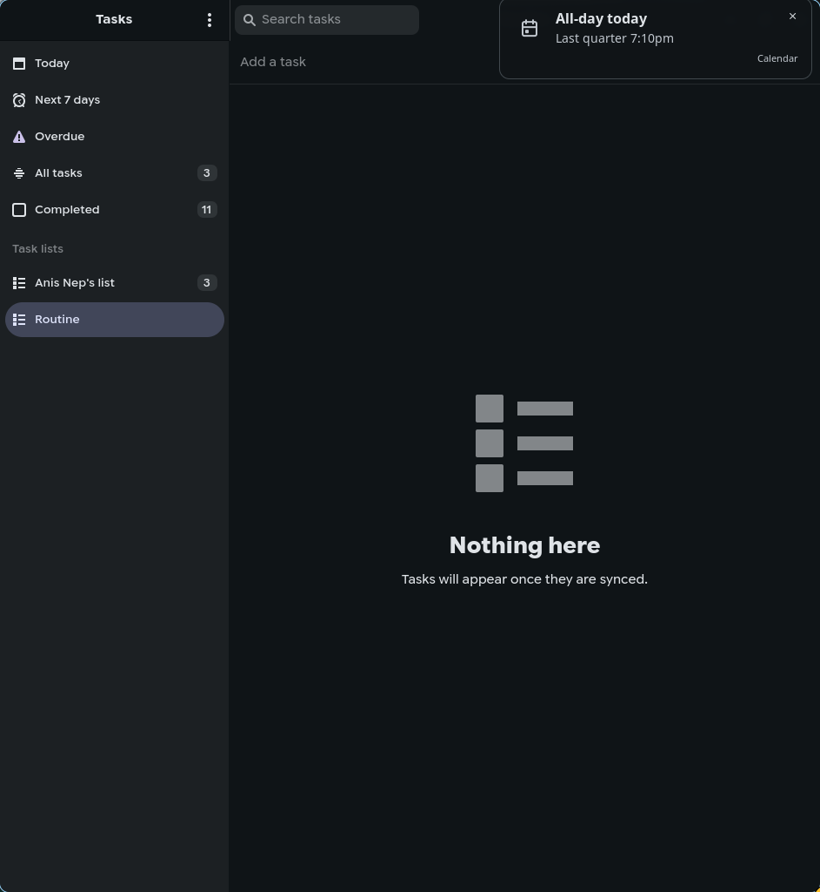
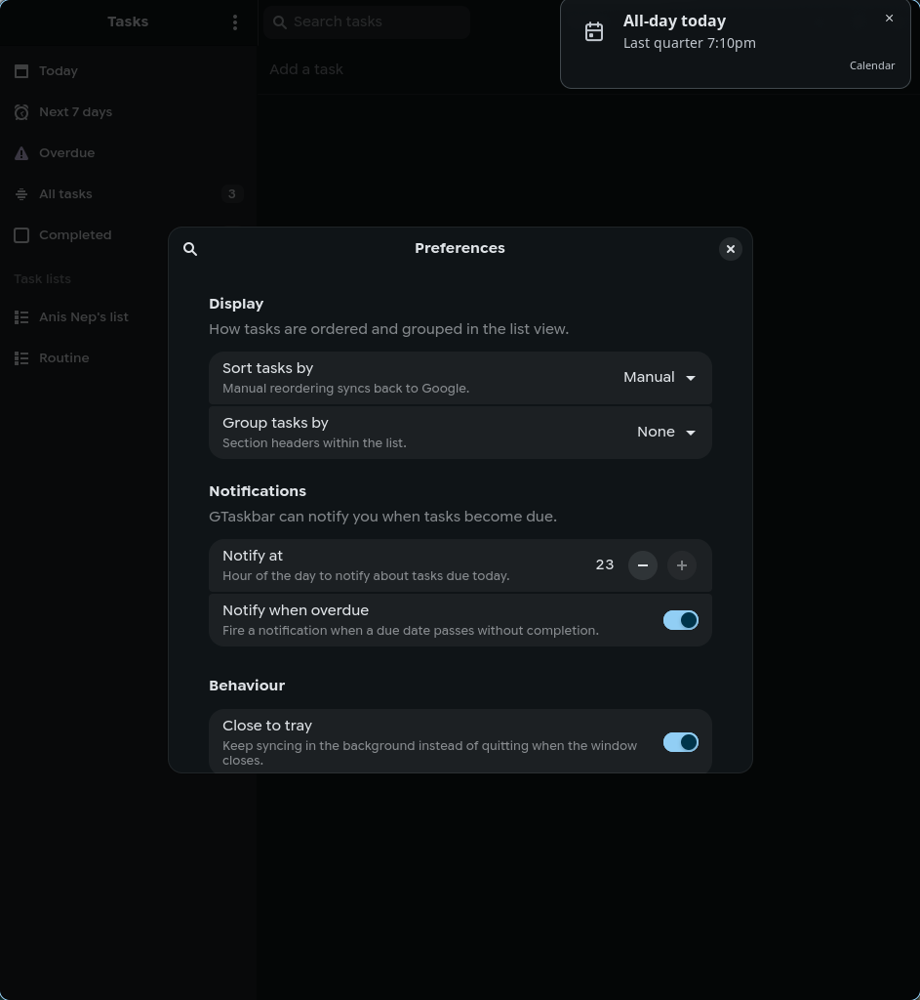
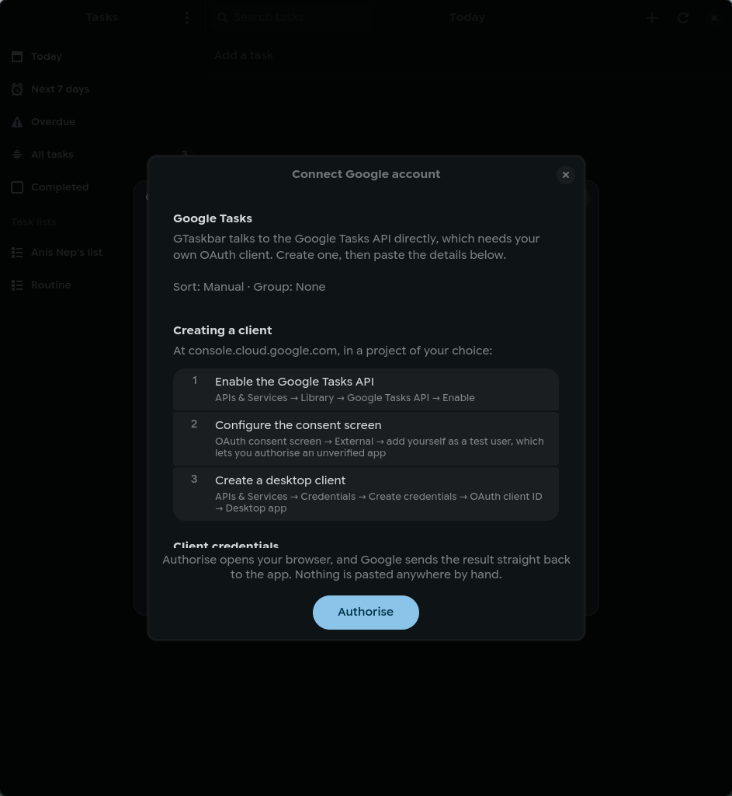

# gtaskbar

A native, tray-first Google Tasks client for Linux, built with GTK4 and libadwaita.

GTaskbar exists because neither Thunderbird nor Betterbird can sync Google
Tasks: Google exposes no CalDAV/VTODO endpoint for task lists, so the "On the
network" calendar wizard in Thunderbird only ever lists calendars. This app
talks to the Google Tasks API directly and gives your tasks a proper native
home on the Linux desktop.

## Status

Working: account connection over OAuth with PKCE, two-way sync with a local
SQLite cache and queued offline writes, task lists with smart views, sorting
and grouping, quick-add, a task editor, notifications with actions, a tray
icon with due-count attention, and autostart. See [Roadmap](#roadmap) for what
remains.

## Screenshots






## Features

- Full two-way sync with Google Tasks via the official REST API
- Tray icon with due-count attention, so the app works without opening a window
- Notifications for tasks that become due, with **Complete**, **Snooze** and
  **Open** actions
- Six sort modes: manual, due date, alphabetical, created, updated, priority
- Grouping by list, due bucket or status
- Quick-add from the main window or the tray (`Ctrl+N`)
- Subtasks with expanders, matching Google Tasks' own hierarchy
- A task editor: title, notes, due date, list, parent, delete with confirmation
- Keyboard shortcuts (`Ctrl+N`, `Ctrl+F`, `Ctrl+R`, `Delete`, `Escape`, `F1`)
- Offline-capable: the UI reads from a local SQLite cache and queues writes

## Requirements

- GTK 4.14 or newer
- libadwaita 1.5 or newer
- A Google account with Google Tasks enabled

These floors are enforced by the crate feature gates in `Cargo.toml` and verified
by CI against Ubuntu 24.04, which ships the oldest supported versions. They are
set to what the app actually uses rather than to the newest release the
bindings support, so the app builds on current LTS distributions.

`adwaita-icon-theme` supplies every interface icon, so the app inherits the
icon theme the desktop is already using.

## Installation

```sh
git clone https://github.com/anishkn04/gtaskbar
cd gtaskbar
./install.sh
```

This builds a release binary and installs it into `~/.local`, along with the
desktop entry, icons and an autostart entry. No root is required.

The installed desktop entries get an absolute `Exec` path rather than a bare
`gtaskbar`. A bare name is resolved through the session's `PATH`, and
`~/.local/bin` is only on the `PATH` of an interactive shell, not of a graphical
session, so a bare name fails to start from the app picker and from autostart
without reporting anything. If you move the binary, re-run `./install.sh` so the
entries are rewritten.

To remove it again:

```sh
./install.sh --uninstall
```

### From source

```sh
cargo build --release
./target/release/gtaskbar
```

## Setting up the Google connection

GTaskbar talks to the Google Tasks API, which requires OAuth 2.0 credentials.
You need to supply your own client:

1. Open the [Google Cloud console](https://console.cloud.google.com) and
   create a project (or pick an existing one).
2. Enable the **Google Tasks API** under *APIs & Services -> Library*.
3. Configure the **OAuth consent screen**:
   - User type: **External**
   - Add your own Google account under *Test users* — this lets you authorise
     the app before it is verified, so you can ignore the "Google hasn't
     verified this app" warning.
4. Create credentials: *APIs & Services -> Credentials -> Create credentials ->
   OAuth client ID -> Application type: **Desktop app***.
5. Download the JSON, or just note the client ID and client secret.
6. Launch GTaskbar, open **Preferences**, and paste the client ID and secret.

Client credentials are stored in your desktop keyring (gnome-keyring or
equivalent), never in the config file and never in this repository. The
repository's `.gitignore` also excludes `client_secret_*.json` and `.env` so
accidentally downloaded credentials cannot be committed.

Google does not support the device-code grant for this API, so GTaskbar uses
the loopback redirect flow: it opens your browser, receives the response on a
temporary `127.0.0.1` port, and discards it.

## Google Tasks API limitations

These are constraints of the API, not bugs in GTaskbar:

| Feature | Status |
| --- | --- |
| Task title, notes, status, due date, subtasks | Fully supported |
| Time of day for a due date | **Not supported.** The API stores only the date and discards the time portion of `due`. |
| Recurring tasks | **Not exposed.** Google Tasks has no recurrence field on the API surface. |
| Priorities, tags, locations, reminders | **Not exposed.** |
| Per-task reminder times | **Not supported.** The API discards the time portion of `due`, so there is one global notify hour for tasks due today, not a time per task. |
| Task ordering | Opaque lexicographic `position` string; reordering uses the `tasks.move` endpoint. |
| Attachments, comments | **Not exposed.** |

Because priority is not a server-side field, GTaskbar's "Priority" sort is
**derived locally**. See [docs/architecture.md](docs/architecture.md#priority-heuristic)
for the exact scoring rules.

The API also has a courtesy limit of 50,000 queries per day, which comfortably
covers a five-minute polling interval.

## Development

```sh
cargo test          # unit tests
cargo clippy --all-targets
cargo fmt
```

Requires the GTK4 and libadwaita development packages. On Arch:

```sh
sudo pacman -S gtk4 libadwaita base-devel
```

## Roadmap

Tracked as GitHub issues and milestones:

1. Application shell
2. Local storage and configuration
3. Google account connection (OAuth)
4. Sync engine
5. Task list user interface
6. Sorting and grouping
7. Tray icon
8. Notifications
9. Polish and packaging

## License

MIT — see [LICENSE](LICENSE).
